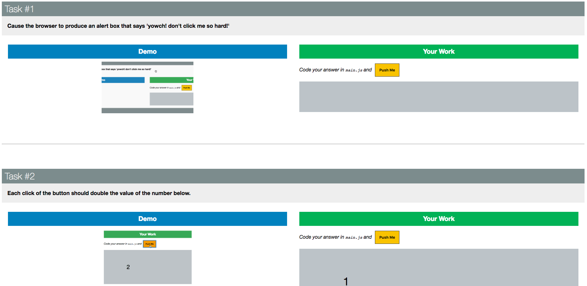

# DOM Manipulation

**Iron Yard Class Assignment**

This repo contains javascript DOM Manipulation exercises. The results are hosted on github.io which can be accessed from the repo desciption.

## Screenshot


## Installation
```
git clone https://reggevans.github.io/dom-manipulation/
open index.html
```
